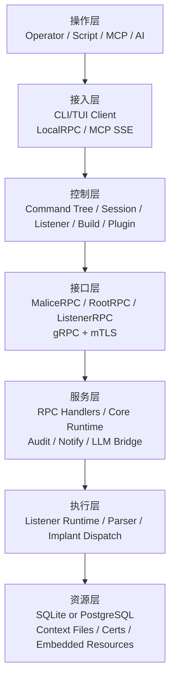
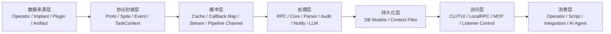

# Malice Network 架构概览

本文档描述 `malice-network` 当前已实现的控制平面架构。

`malice-network` 不是浏览器前端驱动的系统，其核心由 `CLI/TUI Client`、`gRPC/mTLS`、`Server`、`Listener` 和 `Implant` 组成。

## 相关文档

- 快速开始: [getting-started.md](getting-started.md)
- Listener 与 Pipeline: [server/listeners.md](server/listeners.md)
- 构建与 Profile: [server/build.md](server/build.md)
- Client 命令总览: [client/commands.md](client/commands.md)
- Implant 概览: [implant/overview.md](implant/overview.md)

## 组件速览

| 组件 | 作用 | 仓库位置 |
| --- | --- | --- |
| Client | CLI/TUI 操作入口，负责登录、命令派发、会话切换、插件和本地集成 | `client/` |
| Server | 状态管理、任务编排、RPC 服务、审计、通知、构建控制 | `server/` |
| Listener | 与 implant 建立实际通信，承载 TCP/HTTP/REM/Website/Custom 等 Pipeline | `server/listener/` |
| Pipeline | Listener 下的具体传输实现，负责协议封装、解析和路由 | `server/listener/*.go` |
| Implant | 目标侧执行体，当前默认是 `malefic` 家族 | 外部仓库 `chainreactors/malefic` |
| Session | 单个 implant 的运行时状态、任务、缓存和连接生命周期 | `server/internal/core/` |
| MAL | client 侧脚本 / 插件扩展机制，用于自动化、命令编排和集成 | `client/command/mal`、`client/plugin/` |

## 应用层架构

```text
【操作层】【红队操作员】【自动化脚本】【MCP Client】【AI 调用方】

【接入层】【CLI/TUI Client】【LocalRPC】【MCP SSE】【登录认证】【上下文切换】

【控制层】【Cobra 命令树】【Session 管理】【Listener/Pipeline 管理】【Build/Profile/Artifact】【Plugin/MAL/Addon】

【接口层】【MaliceRPC】【RootRPC】【ListenerRPC】【gRPC/mTLS】【Proto/IoM-go】

【服务层】【RPC Handlers】【Core Runtime】【Task/Session 状态机】【Audit/Notify】【LLM Bridge】【Config/Cert】

【执行层】【TCP/HTTP/Bind/REM/Website Listener】【Spite/Parser】【Implant Module 调度】【Mutant/Generate】【任务落盘】

【资源层】【SQLite/PostgreSQL】【Context 目录】【证书资产】【嵌入式 intl/mal 资源】【external 子模块】
```

### 应用层说明

- `client/` 承担接入层和控制层职责，负责命令树、交互界面、会话切换、插件调用、`MCP`/`LocalRPC` 暴露。
- `server/rpc/` 是接口层入口，对外提供 `MaliceRPC`、`RootRPC`、`ListenerRPC` 三类 gRPC 服务。
- `server/internal/core/` 是服务层核心，负责 `Session`、`Task`、`Pipeline`、缓存、回调和运行时编排。
- `server/listener/` 属于执行层，负责 `TCP`、`HTTP`、`Bind`、`REM`、`Website` 等管线的注册与启动。
- `server/internal/db/` 和上下文目录共同构成资源层，分别承载结构化状态和运行时文件资产。
- `helper/intl/`、`helper/intermediate/`、`helper/cryptography/` 等为全局共享能力，贯穿控制层到执行层。

## 数据层架构

```text
【数据来源层】【Operator 命令】【Implant 注册/心跳】【任务结果】【插件输出】【构建产物】【Website 内容】

【协议封装层】【Proto Message】【Event】【TaskContext】【Spite】【LocalRPC/MCP Payload】

【缓冲层】【Session Cache】【Task 回调映射】【Pipeline Channel】【gRPC Stream】【上下文缓存目录】

【处理层】【RPC Handler】【Core Session/Task Runtime】【Parser/Intermediate Callback】【Audit/Notify】【LLM Proxy】

【持久化层】【Session/Task/Pipeline/Profile/Artifact/Context/Website】【SQLite/PostgreSQL】【磁盘缓存与下载目录】

【访问层】【CLI/TUI 输出】【LocalRPC】【MCP Tool/Resource】【Listener 控制流】【配置与证书读取】

【消费层】【操作员终端】【自动化脚本】【外部集成】【AI Agent】【插件生态】
```

### 数据层说明

- 操作命令、implant 回连、任务执行结果、插件输出和构建结果，都会进入统一的协议封装路径。
- 协议主干以 `Proto + Spite + Event + TaskContext` 为中心，在 `gRPC`、`Listener Stream`、`LocalRPC` 之间流转。
- `server/internal/core/` 在处理中承担“状态机 + 回调路由 + 任务编排”的角色，是数据流的中枢。
- `server/internal/parser/` 与 `helper/intermediate/` 负责将底层返回结果转成可展示、可消费的数据。
- `server/internal/db/` 存结构化对象，`server/internal/configs.ContextPath` 下的目录存缓存、下载、截图、请求、任务等文件型数据。
- 最终消费方并不只是 CLI，还包括 `MCP` 客户端、自动化脚本和基于 `LocalRPC` 的外部程序集成。

## Mermaid 视图

### 应用层 Mermaid



### 数据层 Mermaid



## 目录到架构层映射

| 目录 | 主要职责 | 对应层 |
| --- | --- | --- |
| `client/cmd/cli` | 客户端启动入口与命令装配 | 接入层 |
| `client/command` | Cobra 命令树与交互控制 | 控制层 |
| `client/core` | 客户端状态、事件处理、`LocalRPC`、`MCP`、AI 调用 | 接入层 / 控制层 |
| `client/plugin` | 插件运行时、Lua/Yaegi 桥接 | 控制层 |
| `server/rpc` | gRPC 服务注册与 RPC Handler | 接口层 / 服务层 |
| `server/internal/core` | `Session`、`Task`、`Pipeline`、缓存、运行时状态机 | 服务层 |
| `server/listener` | Listener 生命周期与执行管线 | 执行层 |
| `server/internal/parser` | 协议解析与消息转换 | 执行层 / 数据处理层 |
| `server/internal/db` | 数据模型、持久化、迁移、数据库适配 | 持久化层 / 资源层 |
| `server/internal/audit` | 审计记录聚合 | 服务层 / 数据处理层 |
| `server/internal/notify` | 外部通知分发 | 服务层 |
| `server/internal/llm` | LLM Provider 代理桥接 | 服务层 |
| `helper/intl` | 内置 `mal` 插件与资源 | 控制层 / 资源层 |
| `helper/intermediate` | 任务输出回调与中间层函数 | 数据处理层 |
| `helper/cryptography` | 加密与证书相关能力 | 服务层 / 资源层 |
| `external/IoM-go` | Proto、gRPC stub、常量与客户端依赖 | 接口层基础设施 |

## 一句话总结

`malice-network` 的核心形态可以概括成一句话：`Client` 负责操作与编排，`Server` 负责控制与状态，`Listener/Pipeline` 负责投递与连接，`Implant` 负责执行，`DB + Context Files` 负责沉淀结果。
