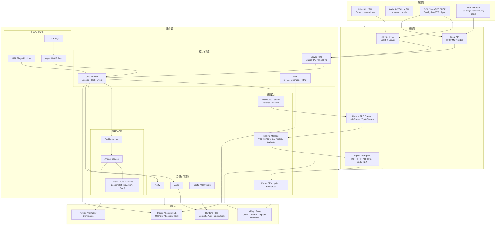

# Malice Network 架构概览

Malice Network 是 IoM 控制平面，主要由 `client/`、`server/`、`server/listener/`、`helper/` 和 `external/` 子模块组成。整体分层不需要继续纵向拆得更细，主图保留展现层、通讯层、服务层和数据层四层；复杂度放在服务层的能力分组中表达。

```mermaid
flowchart TB
    %% 展现层
    subgraph presentation["展现层"]
        direction LR
        cli["Client CLI / TUI<br/>Cobra command tree"]
        gui["WebUI / VSCode GUI<br/>operator console"]
        sdk["SDK / LocalRPC / MCP<br/>Go / Python / TS / Agent"]
        mal["MAL / Armory<br/>Lua plugins / community packs"]
    end

    %% 通讯层
    subgraph communication["通讯层"]
        direction LR
        client_rpc["gRPC / mTLS<br/>Client -> Server"]
        listener_rpc["ListenerRPC Stream<br/>JobStream / SpiteStream"]
        transport["Implant Transport<br/>TCP / HTTP / HTTPS / Bind / REM"]
        local_api["Local API<br/>RPC / MCP bridge"]
    end

    %% 服务层
    subgraph service["服务层"]
        direction TB

        subgraph control["控制与调度"]
            direction LR
            rpc["Server RPC<br/>MaliceRPC / RootRPC"]
            core["Core Runtime<br/>Session / Task / Event"]
            auth["Auth<br/>mTLS / Operator / RBAC"]
        end

        subgraph listener["通信接入"]
            direction LR
            listener_core["Distributed Listener<br/>reverse / forward"]
            pipeline["Pipeline Manager<br/>TCP / HTTP / Bind / REM / Website"]
            parser["Parser / Encryption / Forwarder"]
        end

        subgraph build["构建与产物"]
            direction LR
            profile["Profile Service"]
            artifact["Artifact Service"]
            mutant["Mutant / Build Backend<br/>Docker / GitHub Action / SaaS"]
        end

        subgraph automation["扩展与自动化"]
            direction LR
            plugin["MAL Plugin Runtime"]
            agent["Agent / MCP Tools"]
            llm["LLM Bridge"]
        end

        subgraph governance["治理与可观测"]
            direction LR
            audit["Audit"]
            notify["Notify"]
            config["Config / Certificate"]
        end
    end

    %% 数据层
    subgraph data["数据层"]
        direction LR
        db["SQLite / PostgreSQL<br/>Operator / Session / Task"]
        context["Runtime Files<br/>Context / Audit / Logs / Web"]
        proto["IoM-go Proto<br/>Client / Listener / Implant contracts"]
        assets["Profiles / Artifacts / Certificates"]
    end

    presentation --> communication
    communication --> service
    service --> data

    cli --> client_rpc
    sdk --> client_rpc
    sdk --> local_api
    mal --> local_api
    client_rpc --> rpc
    local_api --> rpc
    rpc --> core
    core --> listener_core
    listener_core --> listener_rpc
    listener_rpc --> pipeline
    pipeline --> transport
    transport --> parser
    core --> profile
    profile --> artifact
    artifact --> mutant
    core --> audit
    core --> notify
    plugin --> core
    agent --> core
    llm --> agent
    auth --> db
    core --> db
    audit --> context
    config --> context
    rpc --> proto
    parser --> proto
    artifact --> assets
```

## 分层映射

| 层级 | 主要代码路径 | 职责 |
| --- | --- | --- |
| 展现层 | `client/cmd/cli/`, `client/command/`, `client/plugin/`, `external/IoM-go` | 提供 CLI/TUI、SDK、LocalRPC、MCP、MAL/Armory 和 Agent 入口。 |
| 通讯层 | `server/rpc/`, `server/forwardrpc/`, `server/listener/`, `external/rem` | 承载 Client 到 Server、Server 到 Listener、Listener 到 Implant 的通信协议和连接形态。 |
| 服务层 | `server/rpc/`, `server/internal/core/`, `server/build/`, `server/internal/mutant/`, `server/internal/llm/`, `server/internal/notify/` | 维护认证授权、Session/Task/Event 调度、Listener/Pipeline 管理、构建产物、插件自动化、审计和通知能力。 |
| 数据层 | `server/internal/db/`, `server/internal/configs/`, `server/internal/audit/`, `server/assets/`, `external/IoM-go/generate/proto/` | 持久化 Operator、Session、Task、Pipeline、Artifact、Context、Website 内容，保存配置、证书、审计日志和 proto 契约。 |

## 运行时链路

1. Client、SDK、LocalRPC 或 MCP 通过 gRPC/mTLS 调用 Server。
2. Server 的 RPC Handler 经过日志、审计和认证授权后进入 Core Runtime。
3. Core Runtime 创建 Task，把操作转换为 Spite 消息，并通过 ListenerRPC 的 JobStream 或 SpiteStream 分发。
4. Listener 运行对应 Pipeline，经 Parser、Encryption 和 Forwarder 与 Malefic/Pulse 交换数据。
5. 执行结果按原链路返回 Server，写入 Task/Context，并通过 EventBroker 同步给 Client。

### 冷启动与 Listener 重连

1. Server 冷启动时只从数据库和 Context 恢复 Session/Task，不依赖尚未注册的 Listener/Pipeline。
2. Listener 注册后先处于 pending 状态；JobStream 使用 begin/session/end 同步所属 Session 的完整快照。
3. Server 发送 snapshot end 后打开 ready 屏障；同一 JobStream 的消息顺序保证 Listener 在处理 Pipeline start 等后续控制前先原子提交 staging map。
4. Checkin、SpiteStream 或 forward response 触发惰性 Session 恢复时，Server 在加入 `core.Sessions` 后显式同步所属 Listener。
5. JobStream 断开后 Listener 重新注册并建流；新快照提交后，以 `SyncPipeline` 恢复 Server 对仍在运行的 Pipeline/Website 的视图。
6. 上述过程恢复控制面状态，不代表 Implant 的 TCP/HTTP 连接已经恢复；实际在线仍以新的 Register/Checkin 和连接建立为准。

## 相关文档

- [核心概念](concept.md)
- [Server 内部机制](server/internals.md)
- [Listener 与 Pipeline 架构](server/listeners.md)
- [构建与 Profile](server/build.md)
- [Server 冷启动 Session 恢复](server/session-startup-recovery-design.md)
