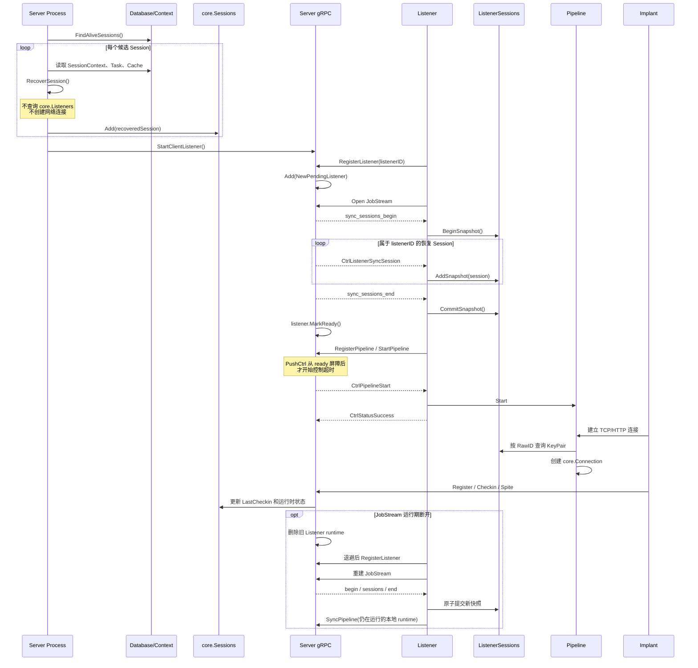

# Server 冷启动 Session 恢复修复方案

> 状态：已实施并验证
>
> 日期：2026-07-27
>
> 适用范围：Server 重启后的 Session 内存恢复、恢复数据向 Listener 的同步，以及 Listener JobStream 重连
>
> 关联现象：`cannot recover session <session-id>, failed to get pipeline`

## 1. 结论

当前故障是一个 **Server 冷启动恢复顺序缺陷**：

1. Server 从数据库恢复 Session 时，Listener 及其 Pipeline 运行时尚未注册；
2. `core.RecoverSession()` 在恢复普通 Session/Task 状态的过程中，提前调用了依赖运行时 Pipeline 的 `initializeSecureManager()`；
3. Pipeline 查找失败后，整个 Session 恢复被中止；
4. `RecoverAliveSession()` 因而没有把该 Session 放入 `core.Sessions`。

日志中的错误：

```text
ERR cannot recover session 2298dded0cc1a02843c8631560ebac8b, failed to get pipeline
```

表示的是：

```text
数据库记录已被 FindAliveSessions 找到
    ↓
Server 尝试重建内存 Session
    ↓
恢复过程错误地要求 Listener/Pipeline 已经在线
    ↓
内存 Session 恢复失败
```

它不表示：

- 数据库中的 Pipeline 记录不存在；
- Listener 的 TCP `accept` 失败；
- Server 能主动让 Implant 重新拨号；
- Implant 一定已经死亡；
- 只要把 Session 灌入内存，物理 TCP 连接就会自动恢复。

本方案的核心是把两类状态分开处理：

```text
阶段 A：Server 从持久化数据恢复自己的内存状态
        不依赖 Listener，不依赖运行时 Pipeline，不代表 Implant 在线

阶段 B：Listener 建立 JobStream 后
        Server 用 begin/session/end 同步完整快照
        Server 发送 end 后打开 ready；同流顺序保证 Listener
        在处理后续普通控制消息前先原子提交快照

阶段 C：Pipeline 启动，Implant 实际连接并 Register/Checkin
        才确认新的通信链路已经建立
```

## 2. 组件和状态归属

这个问题容易混乱，是因为“Session”在不同层里代表不同状态。

| 组件或存储 | 相关对象 | 含义 |
| --- | --- | --- |
| 数据库 | `models.Session`、Task 记录 | 跨进程保存的历史和业务状态 |
| Server Core | `core.Sessions`、`core.Session` | Server 当前进程中的 Session、Task、回调通道等运行时对象 |
| Server Listener Runtime | `core.Listeners`、Pipeline | 当前已连接到 Server 的 Listener 及其已注册 Pipeline |
| Listener | `core.ListenerSessions` | Listener 按 `RawID` 保存的 Session/KeyPair 快照 |
| Listener Transport | `core.Connections` | Listener 当前真正可用的 TCP/HTTP 数据连接 |
| Implant | Malefic 进程 | 主动连接 Pipeline，执行任务并返回结果 |

必须区分下面四个判断：

| 判断 | 能证明什么 | 不能证明什么 |
| --- | --- | --- |
| 数据库中有 Session | Server 曾经保存过该 Session | Implant 当前在线 |
| `core.Sessions` 中有 Session | Server 已恢复业务运行时 | Listener 已启动或 TCP 已连接 |
| `core.ListenerSessions` 中有 Session | Listener 已获得 RawID/KeyPair 快照 | Implant 已经建立物理连接 |
| `core.Connections` 中有 Session 连接 | Listener 当前有可用于收发数据的连接 | 连接以后不会再次断开 |

因此，`RecoverAliveSession()` 更准确的语义是“恢复 Server 运行时状态”，不是“恢复网络连接”。

## 3. 当前启动流程

### 3.1 总入口

当前入口位于 `server/cmd/server/server.go`：

```go
serverReady := false
if !opt.ListenerOnly && opt.Server.Enable {
    err = opt.PrepareServer()
    if err != nil {
        return fmt.Errorf("cannot prepare server, %s", err.Error())
    }
    serverReady = true
}

if !opt.ServerOnly && opt.Listeners.Enable {
    err = opt.PrepareListener()
    if err != nil {
        return fmt.Errorf("cannot prepare listener, %s", err.Error())
    }
}
```

顺序明确是：

```text
PrepareServer()
    ↓
PrepareListener()
```

### 3.2 PrepareServer

`server/cmd/server/options.go` 中，`PrepareServer()` 的关键顺序是：

```go
db.Client, err = db.NewDBClient(opt.Server.DatabaseConfig)
// ...
core.NewBroker()
core.NewSessions()
// ...
err = StartGrpc(fmt.Sprintf("%s:%d", opt.Server.GRPCHost, opt.Server.GRPCPort))
// ...
err = opt.InitListener()
```

其中：

- `core.NewSessions()` 创建空的 Server Session 运行时注册表；
- `StartGrpc()` 先恢复 Session，再启动 gRPC；
- `InitListener()` 只创建 Listener 身份、证书和 auth 文件，不会创建 `core.Listener`，也不会启动 Pipeline。

### 3.3 StartGrpc

当前代码：

```go
func StartGrpc(address string) error {
    // start alive session
    err := RecoverAliveSession()
    if err != nil {
        return err
    }

    _, _, err = rpc.StartClientListener(address)
    if err != nil {
        return err
    }
    return nil
}
```

所以 Server 恢复 Session 时：

```text
core.Sessions 已创建
core.Listeners 仍为空
Listener JobStream 尚未建立
Pipeline 运行时尚未注册
```

这个顺序本身是合理的：Server 应先完成自身状态恢复，再开放 gRPC。错误在于 Session 恢复函数内部依赖了尚未存在的 Listener 运行时。

### 3.4 PrepareListener

只有 `PrepareServer()` 完成后，组合部署模式才会执行：

```go
func (opt *Options) PrepareListener() error {
    serverEnabled := opt.Server != nil &&
        opt.Server.Enable &&
        !opt.ListenerOnly
    return StartListener(opt.Listeners, serverEnabled)
}
```

`listener.NewListener()` 的主要顺序是：

```go
lns.Rpc.RegisterListener(...)
core.GoGuarded("listener-job-stream:"+lns.ID(), lns.Handler, ...)

for _, tcpPipeline := range cfg.TcpPipelines {
    // ...
    err = lns.RegisterAndStart(pipeline)
}
```

Server 收到 `RegisterListener` 后才会执行：

```go
core.Listeners.Add(core.NewListener(req.Name, req.Host))
```

因此，冷启动恢复期间查找 `core.Listeners` 必然可能失败。这不仅发生在本地组合部署中，也发生在以下正常模式中：

- `--server-only`：本进程根本不会启动 Listener；
- 分布式部署：远程 Listener 会在 Server 启动后才连接；
- Listener 重连：Server 已运行，但 Listener 运行时会短暂缺失；
- Listener 启动失败：Server 仍应能恢复并提供历史 Session/Task 数据。

## 4. 当前恢复流程和错误位置

### 4.1 RecoverAliveSession

`server/cmd/server/options.go`：

```go
func RecoverAliveSession() error {
    sessions, err := db.FindAliveSessions()
    if err != nil {
        return err
    }

    if len(sessions) > 0 {
        logs.Log.Debugf("recover %d sessions", len(sessions))
        for _, session := range sessions {
            newSession, err := core.RecoverSession(session)
            if err != nil {
                logs.Log.Errorf(
                    "cannot recover session %s , %s ",
                    session.SessionID,
                    err.Error(),
                )
                continue
            }
            core.Sessions.Add(newSession)
        }
    }
    return nil
}
```

只有 `core.RecoverSession()` 完整成功，Session 才会进入 `core.Sessions`。

### 4.2 RecoverSession 本来应该恢复什么

`server/internal/core/session.go` 中的 `RecoverSession()` 会依次重建：

- SessionContext；
- Session 基础字段；
- Cache；
- `LastCheckin`；
- Session `Ctx` / `Cancel`；
- 历史 Task；
- Task 与 Session 的反向引用；
- Task `Ctx` / `Cancel` / `DoneCh`；
- `Taskseq`；
- 未完成 Task 的 response channel；
- 安全模式所需的 Server 侧运行时管理器。

这就是“把 Session 信息灌回 Server 内存”的实际含义。

它不会做以下事情：

- 不会创建 Listener；
- 不会启动 Pipeline；
- 不会创建 `core.Connections`；
- 不会向 Implant 发起 TCP 连接；
- 不会强制 Implant Register 或 Checkin；
- 不会证明 Implant 当前在线。

### 4.3 直接失败点

当前 `RecoverSession()` 在恢复 Task 之前执行：

```go
err = s.initializeSecureManager(&clientpb.RegisterSession{
    PipelineId:   sess.PipelineID,
    ListenerId:   sess.ListenerID,
    RegisterData: &implantpb.Register{Secure: s.Secure},
})
if err != nil {
    return nil, err
}

s.SetLastCheckin(sess.LastCheckin)
s.Ctx, s.Cancel = context.WithCancel(context.Background())
tasks, tid, err := db.FindTaskAndMaxTasksID(s.ID)
```

而 `initializeSecureManager()` 首先查找运行时 Pipeline：

```go
func (s *Session) initializeSecureManager(
    req *clientpb.RegisterSession,
) error {
    var (
        pipeline *clientpb.Pipeline
        ok       bool
    )

    if req.ListenerId != "" {
        pipeline, ok = Listeners.FindByListener(
            req.ListenerId,
            req.PipelineId,
        )
    } else if s.ListenerID != "" {
        pipeline, ok = Listeners.FindByListener(
            s.ListenerID,
            req.PipelineId,
        )
    } else {
        pipeline, ok = Listeners.Find(req.PipelineId)
    }

    if !ok {
        return fmt.Errorf("failed to get pipeline")
    }

    if pipeline == nil ||
        pipeline.Secure == nil ||
        !pipeline.Secure.Enable {
        return nil
    }

    if req.RegisterData.Secure == nil ||
        !req.RegisterData.Secure.Enable {
        return nil
    }

    // ...
}
```

这里有两个问题：

1. 持久化状态恢复错误地依赖了进程内 Listener/Pipeline 状态；
2. 代码在检查 Session 和 Pipeline 是否启用安全模式之前，就要求 Pipeline 必须存在。

所以即使该 Session 根本没有启用安全模式，只要冷启动时 Pipeline 尚未注册，也会返回 `failed to get pipeline`。

失败发生后，后面的 Task、Taskseq、response channel 等都不会恢复，`core.Sessions.Add(newSession)` 也不会执行。

### 4.4 为什么当前 PushCtrl 不能补救

安全初始化结束时会调用：

```go
func (s *Session) PushCtrl() {
    lns, err := Listeners.Get(s.ListenerID)
    if err != nil {
        return
    }
    s.Save()
    lns.PushCtrl(&clientpb.JobCtrl{
        Ctrl:    consts.CtrlListenerSyncSession,
        Session: s.ToProtobufLite(),
    })
}
```

冷启动恢复时 Listener 尚未注册，因此即使不返回错误，这个函数也只会直接返回。之后没有一个可靠的“Listener 上线后补发全部已恢复 Session”步骤。

这意味着只删除 `failed to get pipeline` 还不完整：

- Server 可以恢复 `core.Sessions`；
- 但 Listener 仍可能拿不到恢复 Session 的 `RawID` 和 `KeyPair`；
- 安全 Pipeline 建立连接时可能只能依赖 Pipeline 预共享密钥，无法使用 Session 最新密钥。

## 5. 不采用的方案

### 5.1 不使用 `serverReady && listenerReady`

不应把 Session 恢复改成：

```go
if serverReady && listenerReady {
    RecoverAliveSession()
}
```

原因：

1. `--server-only` 是合法模式，Server 不应因为没有本地 Listener 就放弃恢复历史 Session/Task；
2. 远程 Listener 不会通过本地 `listenerReady` 表达；
3. 多 Listener 可以在不同时间连接，单个布尔值无法描述它们；
4. Session 属于 Server，恢复责任不应由 Listener 是否在线决定；
5. 这会掩盖错误依赖，而不是消除错误依赖。

### 5.2 不把 Listener 强行提前到 Server 之前

Listener 需要通过 gRPC 注册到 Server。若为了 Session 恢复而要求 Listener 先启动，会形成循环依赖：

```text
Server 等 Listener 才恢复
Listener 等 Server gRPC 才能注册
```

### 5.3 不删除启动恢复

完全删除 `RecoverAliveSession()` 会导致：

- Server 重启后暂时看不到历史 Session；
- 未完成 Task 的运行时对象无法恢复；
- Task ID 续号可能依赖后续偶然回连；
- 只有 Implant 再次 Register/Checkin 后才重建部分状态；
- Server-only 管理和查询能力退化。

### 5.4 不把“内存恢复”当成“自动回连”

Server 修复后可以正确恢复 Session 运行时，但 Implant 是否回连仍取决于：

- Implant 进程是否仍运行；
- 网络是否可达；
- Pipeline 是否成功启动；
- Implant 的心跳和重连逻辑；
- Listener 是否真正建立了 `core.Connections`。

因此，本修复解决的是 `failed to get pipeline` 和 Server/Listener 状态恢复缺口，不承诺让一个没有任何后续网络活动的 Implant 自动复活。

## 6. 修复原则

实现需要满足以下不变量：

1. `core.RecoverSession()` 只依赖数据库、Context 文件和纯内存构造；
2. 非安全 Session 恢复时不查找 Pipeline；
3. 安全 Session 优先恢复已持久化的 `SessionContext.Secure` 和 `KeyPair`，不在冷启动阶段覆盖它们；
4. Server-only 模式没有 Listener 时仍能完成 Session/Task 恢复；
5. 路由判断和发送内容必须来自同一个 Session protobuf 快照；
6. Listener 每次建立新的 JobStream 时，都会收到属于自己的完整 Session 快照；
7. 完整快照使用 begin/end 边界，并在 Listener 端原子替换旧映射；
8. Pipeline start 等普通控制消息必须等待 Session 快照提交完成；
9. Session 在运行期惰性恢复后，必须在加入 `core.Sessions` 后显式同步到 Listener；
10. Listener 的 JobStream 断开后必须重新注册、重新建流，并把仍在运行的 Pipeline/Website 状态同步回 Server；
11. Session 恢复不产生“Implant 已在线”的错误语义；
12. 不修改 proto，不要求 Implant 配合升级。

## 7. 实际实现

### 7.1 持久化恢复与在线 Pipeline 初始化解耦

文件：

```text
server/internal/core/session.go
```

`RecoverSession()` 不再调用需要在线 Pipeline 的
`initializeSecureManager()`，而是只从已持久化的
`SessionContext` 恢复安全运行时：

```go
func (s *Session) restoreSecureManagerFromContext() {
    if s == nil ||
        s.SessionContext == nil ||
        s.Secure == nil ||
        !s.Secure.Enable {
        return
    }

    s.SecureManager = NewSecureSpiteManager(s)
}
```

恢复入口现在执行：

```go
s.restoreSecureManagerFromContext()
```

恢复后的职责变化如下：

| 路径 | 安全状态来源 | 是否查运行时 Pipeline |
| --- | --- | --- |
| `RecoverSession()` | 数据库中的 SessionContext / KeyPair | 否 |
| 新 Implant `RegisterSession()` | 当前 Register 请求 + 当前 Pipeline | 是 |
| Listener JobStream 建立 | Server 已恢复的 Session 快照 | 否 |

在线首次注册仍走原有 `initializeSecureManager()`，因为此时使用当前
Pipeline 的安全配置是正确依赖。两条路径不再混用。

### 7.2 Task 恢复以数据库和日志的最大编号为准

同一文件中的恢复逻辑同时修正了两个边界：

```go
tasks, tid, err := db.FindTaskAndMaxTasksID(s.ID)
if err != nil {
    return nil, err
}
logID, err := s.RecoverTaskIDByLog()
if err != nil {
    return nil, err
}
if uint32(logID) > tid {
    tid = uint32(logID)
}
s.Taskseq.Store(tid)
```

`RecoverTaskIDByLog()` 在任务目录不存在时返回 `0, nil`，因此新 Session
不需要预先存在任务日志目录。`Session.Recover()` 只为真正未完成的任务
创建响应通道：

```go
for _, task := range s.Tasks.All() {
    if !task.Finished() {
        ch := make(chan *implantpb.Spite, 16)
        s.responses.Store(task.Id, ch)
    }
}
```

这避免数据库最大 Task ID 为 30、磁盘日志最大 Task ID 为 31 时再次复用
31，也避免已有 `FinishTime` 的任务因为 `Cur < Total` 被错误恢复为活动等待。

### 7.3 Server 生成一次快照，再按该快照路由

文件：

```text
server/rpc/rpc-listener.go
```

每个 Session 只调用一次 `ToProtobufLite()`。过滤依据和实际发送内容均来自
这个不可变 protobuf 快照：

```go
func sessionSnapshotsForListener(listenerID string) []*clientpb.Session {
    snapshots := make([]*clientpb.Session, 0)
    for _, session := range core.Sessions.All() {
        if session == nil {
            continue
        }
        snapshot := session.ToProtobufLite()
        if snapshot.ListenerId == listenerID {
            snapshots = append(snapshots, snapshot)
        }
    }
    sort.Slice(snapshots, func(i, j int) bool {
        return snapshots[i].SessionId < snapshots[j].SessionId
    })
    return snapshots
}
```

不能先读取 `RoutingSnapshot()`，释放锁后再调用 `ToProtobufLite()`。如果
Session 恰好在两次读取之间从 Listener A 迁移到 Listener B，A 会通过第一次
过滤，却收到包含 B 的 ListenerID 和 KeyPair 的第二份数据。一次 protobuf
快照消除了这个跨 Listener 泄漏窗口。

### 7.4 Server 使用 begin/session/end 发送完整快照

本次没有修改 proto。begin/end 使用现有 `JobCtrl.Ctrl` 字符串承载：

```go
const (
    CtrlListenerSessionSnapshotBegin = "sync_sessions_begin"
    CtrlListenerSessionSnapshotEnd   = "sync_sessions_end"
)
```

Server 在同一条 JobStream 上依次发送：

```go
func syncRecoveredSessions(
    stream listenerrpc.ListenerRPC_JobStreamServer,
    listenerID string,
) error {
    if err := stream.Send(&clientpb.JobCtrl{
        Ctrl: core.CtrlListenerSessionSnapshotBegin,
    }); err != nil {
        return fmt.Errorf("begin session snapshot: %w", err)
    }
    for _, snapshot := range sessionSnapshotsForListener(listenerID) {
        if err := stream.Send(&clientpb.JobCtrl{
            Ctrl:    consts.CtrlListenerSyncSession,
            Session: snapshot,
        }); err != nil {
            return fmt.Errorf("sync session %s: %w", snapshot.SessionId, err)
        }
    }
    return stream.Send(&clientpb.JobCtrl{
        Ctrl: core.CtrlListenerSessionSnapshotEnd,
    })
}
```

Session 按 `SessionId` 排序，使测试、日志和现场比对具有稳定顺序。即使没有
任何 Session，Server 也会发送 begin/end，从而明确表达“该 Listener 的完整
快照为空”，而不是“没有收到快照”。

### 7.5 Pending Listener 和 ready 屏障保证控制消息不会提前超时

只让 JobStream 先发送快照仍不够。原来的 `RegisterListener()` 一返回，本地启动
流程就可能调用 `StartPipeline()`；它会立即进入 10 秒的控制等待。如果快照数量
较大或远端出现背压，Pipeline start 可能先在 Server 侧超时并被禁用，随后却在
Listener 侧真正启动，形成状态分裂。

修复后，普通 gRPC Listener 注册为 pending：

```go
core.Listeners.Add(core.NewPendingListener(req.Name, req.Host))
```

`PushCtrlContext()` 在分配控制 ID 和启动原有队列超时之前先等待 ready：

```go
if err := l.WaitReady(ctx); err != nil {
    return 0
}
ctrl.Id = NextCtrlID()
```

`JobStream()` 完成初始快照后才打开屏障：

```go
if err := syncRecoveredSessions(stream, listenerID); err != nil {
    return err
}
lns.MarkReady()
```

因此快照耗时不消耗 `PushCtrl` 的 10 秒队列超时，也不消耗随后
`WaitCtrl` 的状态等待时间。Forward Listener 等不经过该初始快照协议的旧路径仍
使用立即 ready 的 `NewListener()`。

### 7.6 Listener 端原子替换完整 Session 映射

文件：

```text
server/internal/core/connection.go
server/listener/listener.go
```

Listener 不再把完整快照逐条直接写进活动映射，而是写入 staged 映射：

```go
case core.CtrlListenerSessionSnapshotBegin:
    core.ListenerSessions.BeginSnapshot()
    return nil
case consts.CtrlListenerSyncSession:
    core.ListenerSessions.AddSnapshot(msg.Session)
    return nil
case core.CtrlListenerSessionSnapshotEnd:
    core.ListenerSessions.CommitSnapshot()
    if lns.restoreOnSnapshot.Swap(false) {
        lns.scheduleRuntimeReregistration()
    }
    return nil
```

`BeginSnapshot()` 创建新的 staged map；同步期间连接读取仍使用旧的 active map。
`CommitSnapshot()` 在锁内一次性把 active 指针替换为 staged 指针。结果是：

- 不会向连接暴露半份快照；
- 未出现在新完整快照中的删除或迁移 Session 会在提交时消失；
- JobStream 中途断开时 `AbortSnapshot()` 丢弃未完成 staging，旧活动快照继续可用。

这给“完整快照”定义了明确的旧条目清理语义。

### 7.7 运行期惰性恢复后显式同步

冷启动快照只能覆盖建流时已经位于 `core.Sessions` 的记录。某些 Session 可能
因 `FindAliveSessions()` 的筛选没有在冷启动恢复，但随后通过 Checkin、
SpiteStream 或 forward response 从数据库惰性恢复。

这些入口统一调用：

```go
func activateRecoveredSession(session *core.Session) {
    if session == nil {
        return
    }
    core.Sessions.Add(session)
    session.PushCtrl()
}
```

顺序必须是先加入 Server 运行时，再把同一份 Session/KeyPair 状态推给所属
Listener。调用点位于：

```text
server/rpc/rpc-implant.go
server/rpc/rpc-listener.go
server/rpc/rpc-forward-listener.go
```

`PushCtrl()` 本身也只生成一次 protobuf 快照，并使用该快照的 `ListenerId`
查找 Listener 和发送，避免运行期同步重现跨 Listener 竞态。

### 7.8 JobStream 断开后重新注册并恢复 Server 运行时视图

文件：

```text
server/listener/listener.go
```

原来的 `Handler()` 在 `Recv()` 出错后直接返回，外层 `GoGuarded` 只记录错误，
不会重启 Handler。Server 同时会删除该 Listener，所以远程 Listener 进程仍在
运行也无法自动恢复。

现在 `Handler()` 是带有上限退避的生命周期循环：

```go
for {
    if needsRegistration {
        if err := registerListenerRPC(lns); err != nil {
            // wait with bounded backoff, then retry
            continue
        }
    }

    opened, err := lns.runJobStreamOnce()
    if opened {
        needsRegistration = true
    }
    // wait with bounded backoff, then reopen
}
```

每次成功打开过的 JobStream 断开后，Listener 都先重新调用
`RegisterListener()`，再建立新 JobStream，并设置一次性恢复标记。新流收到
begin/session/end 并提交快照后，Listener 才会把本地仍在运行的 Pipeline 和 Website 通过
`SyncPipeline()` 同步回 Server：

```go
for _, runtime := range runtimes {
    runtime.ListenerId = lns.ID()
    _, err := lns.Rpc.SyncPipeline(lns.Context(), runtime)
    // collect errors and continue syncing the remaining runtimes
}
```

首次启动的快照不会执行该恢复，避免与本地 runtime 初始化并发。重连时也不能
重复调用 `RegisterPipeline()` 和 `StartPipeline()`，因为这些运行时在
Listener 进程中并没有停止；目标只是重新建立 Server 的数据库/Core Runtime
视图，而不是启动第二份本地监听器。

### 7.9 Re-register 字段完整性作为后续加固

`server/internal/core/session.go` 的 `Session.Update()` 当前更新 Name、ListenerID、PipelineID、Timer、Modules、Addons 和 SysInfo，但不会完整刷新 `Type`、`RawID`、`Target`、`Secure`。

这不是本次 `failed to get pipeline` 的直接原因。为了保持变更聚焦，建议分成后续独立修复：

1. 明确哪些 Register 字段允许在 re-register 时改变；
2. 在锁内更新允许变化的持久化字段；
3. 若安全模式或 Pipeline 发生变化，再使用已经在线的实际 Pipeline 重建/关闭 `SecureManager`；
4. 增加 Pipeline 切换、安全模式切换和旧版本 SessionContext 的兼容测试。

在没有定义上述字段迁移语义前，不应在本次冷启动修复中顺便重写 `Session.Update()`。

## 8. 修改后的完整时序



这个流程中有三个明确的完成点：

| 完成点 | 含义 |
| --- | --- |
| `core.Sessions.Add` 完成 | Server 内存恢复完成 |
| Listener 处理完 `sync_sessions_end` | Listener 原子提交 Session/KeyPair 完整快照 |
| Implant Register/Checkin 且 Connection 建立 | 实际通信链路恢复 |

三者不能互相替代。

## 9. 对任务流程的影响

假设 Server 重启前 Session 已执行过 Task 1 到 Task 30，Task 31 尚未完成。

### 当前错误流程

```text
Server 重启
    ↓
RecoverSession 查不到运行时 Pipeline
    ↓
整个 Session 恢复失败
    ↓
Taskseq、Task 31、response channel 均未进入内存
    ↓
Implant 后续 Register 时可能被当作新内存 Session 处理
```

### 修复后流程

```text
Server 重启
    ↓
从数据库恢复 Session、Task 1..31、Taskseq 和未完成回调通道
    ↓
Listener 建立 JobStream，收到 Session/KeyPair 快照
    ↓
Pipeline 启动
    ↓
Implant 实际回连并 Register/Checkin
    ↓
新建任务从恢复后的 Taskseq 继续编号
```

修复不会自动重放 `ls`、`whoami`、`id` 等非幂等或状态未知的历史请求。是否重投未完成任务属于单独的任务可靠性设计，不应混入 Session 冷启动恢复。

## 10. TDD 测试覆盖

实现按“先写失败测试，再修改生产代码”的顺序完成。新增覆盖如下：

| 测试文件 | 核心用例 |
| --- | --- |
| `server/rpc/rpc_session_startup_recovery_test.go` | 无运行时 Pipeline 恢复、Task ID 取数据库/日志最大值、Finished Task 不创建响应通道 |
| `server/internal/core/listener_startup_sync_test.go` | pending Listener 阻塞普通控制消息、完整快照原子替换旧条目 |
| `server/rpc/rpc_session_snapshot_test.go` | begin/session/end 先于 Pipeline start、运行期惰性恢复在 Add 后同步 |
| `server/listener/listener_session_snapshot_test.go` | Listener 原子提交快照、仅在重连快照后调度运行时重同步 |
| `server/listener/transport_runtime_test.go` | JobStream 断开后先重新注册再开流，只用 SyncPipeline 恢复活动 runtime |

关键回归测试名称：

```text
TestRecoverSessionDoesNotRequireRuntimePipeline
TestRecoverSessionTaskseqUsesDatabaseAndLogMaximum
TestRecoverSessionFinishedTaskHasNoResponseChannel
TestPendingListenerBlocksControlUntilSnapshotReady
TestListenerSessionsCommitSnapshotAtomicallyReplacesOldEntries
TestJobStreamSendsAtomicSessionSnapshotBeforePipelineStart
TestActivateRecoveredSessionSyncsListenerAfterAddingRuntime
TestHandleJobCtrlCommitsSessionSnapshotAtomically
TestReconnectSnapshotEndSchedulesActiveRuntimeReregistration
TestInitialSnapshotEndDoesNotScheduleRuntimeReregistration
TestRestoreRuntimeRegistrationsOnlySyncsActiveRuntimes
TestListenerHandlerReregistersBeforeReopeningJobStream
```

这些测试分别约束恢复层、Server 到 Listener 的发送层、Listener 接收层和断线
重连层，避免只验证单个函数而遗漏跨阶段顺序。

验证结果：

| 命令 | 结果 |
| --- | --- |
| `go test -race ./server/internal/core -count=1 -timeout 180s` | 通过 |
| `go test -race ./server/rpc -count=1 -timeout 240s` | 通过 |
| `go test -race ./server/listener -count=1 -timeout 180s` | 通过 |
| `go vet ./...` | 通过 |
| `go test ./... -count=1 -timeout 300s` | 通过 |
| `CGO_ENABLED=0 go build ./...` | 通过 |

## 11. 验收标准

修复完成需同时满足：

- Server 冷启动不再因运行时 Pipeline 尚未注册而输出 `failed to get pipeline`；
- `--server-only` 能恢复数据库中的候选 Session 和 Task；
- `core.Sessions.Get(sessionID)` 在恢复阶段即可找到 Session；
- Taskseq、历史 Task 和未完成回调通道恢复正确；
- Finished Task 不会恢复活动响应通道；
- Listener 建立 JobStream 后收到 begin/session/end 完整快照；
- 完整快照原子提交，并清除不再属于该 Listener 的旧条目；
- pending Listener 在快照完成前不启动 Pipeline 控制超时；
- `CtrlListenerSyncSession` 和 snapshot end 均在 `CtrlPipelineStart` 之前；
- 多 Listener 之间没有 Session/KeyPair 串流；
- Checkin、SpiteStream 和 forward response 的惰性恢复会同步 Listener；
- JobStream 断开后 Listener 会重新注册并重建流；
- 重连后的本地 Pipeline/Website 通过 `SyncPipeline` 恢复 Server 视图；
- 非安全 Session 不创建 `SecureManager`；
- 安全 Session 不在冷启动时丢失持久化 KeyPair；
- 不修改 proto，不要求 Implant 升级；
- 现有 Core、RPC、Listener 测试通过；
- `go vet ./...`、`go test ./... -count=1 -timeout 300s` 和 `CGO_ENABLED=0 go build ./...` 在可用环境中通过。

## 12. 实际修改文件

生产代码：

| 文件 | 修改内容 |
| --- | --- |
| `server/internal/core/session.go` | 纯持久化恢复、Task ID 最大值、Finished Task 响应通道、单快照 PushCtrl |
| `server/internal/core/listener.go` | pending/ready Listener 生命周期屏障 |
| `server/internal/core/connection.go` | ListenerSessions staging 与原子提交 |
| `server/rpc/rpc-listener.go` | 快照过滤、begin/session/end、JobStream ready |
| `server/rpc/session_recovery.go` | 运行期惰性恢复的 Add + Listener 同步入口 |
| `server/rpc/rpc-implant.go` | Checkin 惰性恢复接入统一激活 |
| `server/rpc/rpc-forward-listener.go` | forward response 惰性恢复接入统一激活 |
| `server/listener/listener.go` | 快照接收、JobStream 重连、运行时 SyncPipeline |

测试代码：

| 文件 | 修改内容 |
| --- | --- |
| `server/rpc/rpc_session_startup_recovery_test.go` | Session/Task 冷启动恢复回归 |
| `server/internal/core/listener_startup_sync_test.go` | ready 屏障与原子映射 |
| `server/rpc/rpc_session_snapshot_test.go` | JobStream 顺序与运行期同步 |
| `server/listener/listener_session_snapshot_test.go` | Listener 快照提交与恢复调度 |
| `server/listener/transport_runtime_test.go` | JobStream 重新注册时序 |

本次不需要修改：

| 文件或模块 | 原因 |
| --- | --- |
| `server/cmd/server/server.go` | 总体启动顺序不是根因 |
| `external/IoM-go` proto | 现有 `JobCtrl.Session` 和控制字符串已足够 |
| Implant | Server 冷启动内存恢复不应依赖 Implant 改动 |
| `serverReady && listenerReady` | 不适合 Server-only 和远程 Listener |

## 13. 配置和部署影响

本实现不增加配置项，不改变 auth 文件，不改变 mTLS 证书，也不改变端口。

升级后无需重新生成：

- Server auth；
- Client auth；
- Listener auth；
- Implant Artifact；
- Pipeline Profile。

部署验证示例：

```text
1. 保持数据库中存在一个最近活跃的 Session
2. 停止 Server 和 Listener
3. 仅以 --server-only 启动 Server
4. 确认没有 failed to get pipeline
5. 通过 API/Client 确认 Session 和历史 Task 已进入 Server 运行时
6. 启动远程或本地 Listener
7. 确认 begin/session/end 完成后才发送 pipeline_start
8. 等待 Implant 实际 Register/Checkin
9. 再下发新的只读任务验证端到端链路
10. 只中断 Listener 的 JobStream，不停止 Listener 进程或本地 Pipeline
11. 确认 Listener 自动重新注册并重建 JobStream
12. 确认新快照提交后，仍在运行的 Pipeline/Website 被 SyncPipeline 回 Server
```

建议增加不包含密钥内容的结构化日志：

```text
server - session_hydrated session=<id> listener=<id> pipeline=<id>
server - listener_session_snapshot listener=<id> sessions=<count>
```

日志中禁止输出公钥以外的敏感材料，尤其不能输出私钥。

## 14. 与其他问题的边界

本实现解决 Server 冷启动恢复和 Listener 控制流重建。以下问题仍是独立故障：

| 问题 | 与本方案关系 |
| --- | --- |
| TCP/NAT 空闲连接被回收 | 可能导致 Implant 不再有物理连接，但不是 `failed to get pipeline` 的原因 |
| Implant 半开连接检测和重连 | 决定 Implant 是否实际回连，本实现不修改 |
| Sender 背压导致任务批次丢失 | 属于活连接发送队列问题，已有独立分析和修复 |
| Download 内容广播放大 | 属于任务内容分发范围问题，与启动恢复无关 |
| 未完成任务是否自动重投 | 涉及幂等性和执行语义，需要单独设计 |
| `FindAliveSessions` 的存活窗口 | 决定哪些数据库记录在冷启动时恢复；未命中者仅在后续活动到达时惰性恢复 |

TCP 掉线和 Sender 问题见
[TCP 会话掉线导致任务无输出：根因分析](tcp-session-drop-analysis.md)。

## 15. 最终设计判断

正确的依赖方向应该是：

```text
持久化数据
    ↓
Server Session 运行时
    ↓
Listener 注册并建立 JobStream
    ↓
Listener 原子提交 Session 快照，Server 打开 ready 屏障
    ↓
Pipeline 启动
    ↓
Implant 实际回连
```

不应该是：

```text
Server 想恢复 Session
    ↓
要求 Listener/Pipeline 已经存在
    ↓
但 Listener 又必须等 Server gRPC 启动后才能注册
```

因此，修复重点不是增加一个启动布尔判断，而是消除
`RecoverSession()` 对易失运行时对象的反向依赖，并用“注册 pending Listener
→ 原子 Session 快照 → ready → 普通控制”的顺序恢复控制面。运行期 JobStream
断开时，同一流程会在重新注册后再次执行，随后用 `SyncPipeline()` 恢复 Server
对仍在运行的 Listener runtime 的视图。
